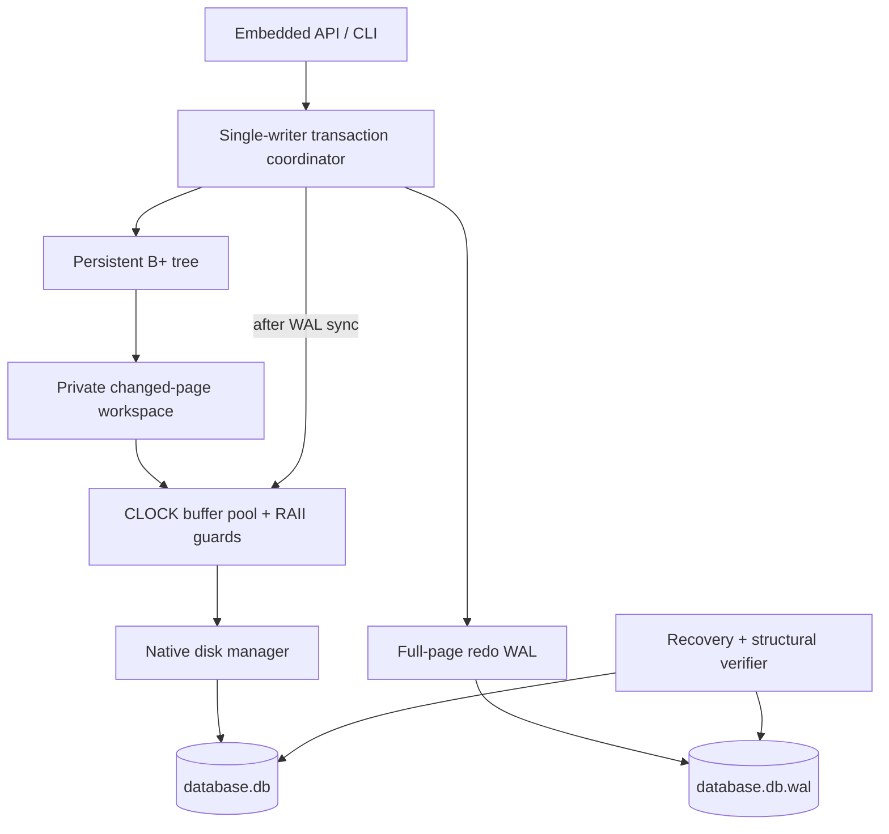
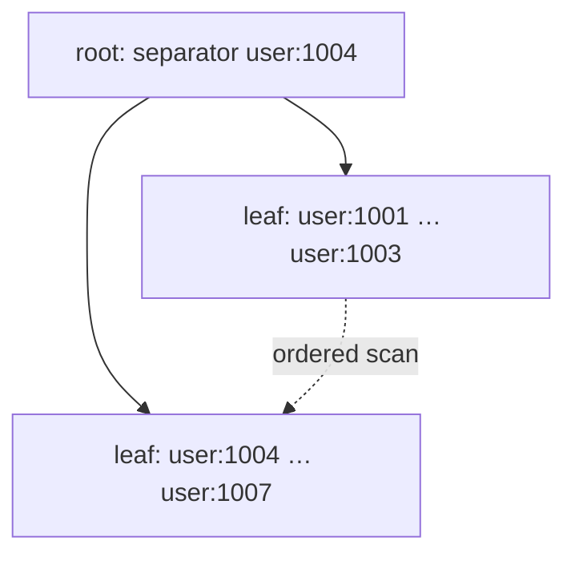
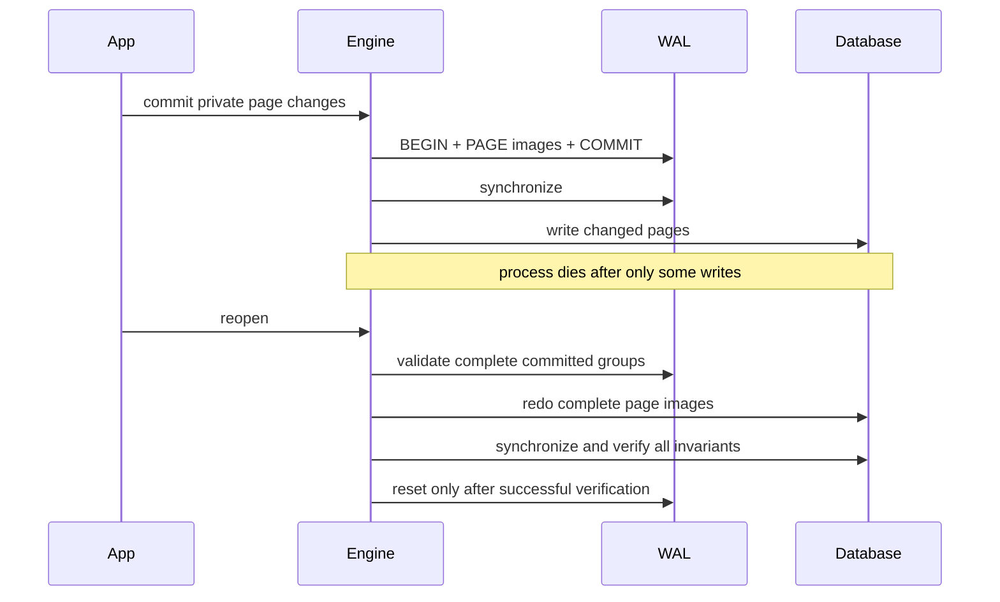

# AtlasDB

**A transactional embedded storage engine, written from scratch in C++20.**

AtlasDB explores what it takes to make an ordered map survive a process dying
in the middle of a multi-page update. It implements its own disk format, slotted
pages, CLOCK buffer pool, persistent B+ tree, transaction workspaces, physical
write-ahead log and crash recovery. It uses CMake and the standard library plus
native operating-system file APIs; there are no third-party runtime or test
dependencies.

This is a systems engineering portfolio project, not a replacement for SQLite,
PostgreSQL or RocksDB. The interesting result is the connection between an
explicit persistence protocol and executable correctness checks.

## What it guarantees

* Atomic insert/update/delete transactions, read-your-writes, explicit rollback
  and automatic rollback on destruction of an active transaction.
* Successful modifying commits synchronize WAL before writing data pages, then
  synchronize the database before returning.
* Recovery replays complete committed page-image groups after a process crash.
  An interrupted recovery can itself be restarted.
* Database reads observe committed data. **Single active writer / serialized
  public API**: another `begin()` on that instance receives `BusyError`.
  There is no MVCC.
* Persistent page checksums, strict log parsing and structural validation catch
  damage and malformed page graphs. Ambiguous corruption fails closed.

These guarantees assume a local filesystem/device honoring OS sync calls. A
failed commit may be **IN_DOUBT**, requiring reopen to discover the persisted
outcome. The engine does not claim full SQL-style ACID, arbitrary power-loss
safety, parallel read execution or recovery from arbitrary media corruption.

## Architecture



The tree never writes directly to disk. It operates through a page-access
interface backed by a private transaction workspace. That separation makes
rollback real: uncommitted images are discarded without having leaked into
the committed cache or data file.

### Storage and page layout

Pages are 4096 bytes. Page zero stores the root, allocation high-water mark,
free-list head, record count and database identity. Every page has a version,
type, ID, LSN, slot bounds and CRC-32. Encoding is explicit little-endian, with
no raw C++ structs written to disk.

```text
| 64-byte header | slot directory -> | free space | <- variable record payloads |
```

Slots hold offset/length pairs. Deletion leaves reusable slots; compaction
preserves slot identity. The tree writes sorted, compact node images. Freed
tree pages form a transactional free list and are reused by later splits.

### Persistent B+ tree

Leaves contain key/value records and next-leaf links. Internal nodes contain
separator keys and page IDs. Insert supports leaf, internal and root splits.
Delete redistributes or merges siblings, propagates underflow and collapses a
single-child root. Scans follow the leaf chain in key order.



Version 1 accepts 0–128-byte keys and 0–512-byte values, including empty and
binary strings. These are byte limits, not character limits. Capacity is derived
from worst-case encoded sizes: six records per leaf and 29 children per
internal node. These conservative bounds simplify the occupancy proof but
waste space for short records. [The tree design](docs/btree.md) explains the
arithmetic, alternatives and performance cost.

### Buffer pool

The configurable cache has a page-to-frame table, pin counts, dirty flags,
per-frame latches and CLOCK replacement. Move-only guards release pins
automatically. Pinned frames cannot be evicted. Dirty writes independently
check that the page's LSN is covered by the durable WAL boundary.

### Transactions, WAL and crash recovery

A modifying commit logs BEGIN, complete changed-page images, and COMMIT with an
image count. Only after WAL synchronization can committed images enter the
cache and reach disk. Database synchronization precedes successful return.
Rollback needs no disk undo because the design does not steal private pages.



A SESSION marker distinguishes an interrupted session from a cleanly closed
log. Recovery reports actual records scanned, committed/incomplete transaction
counts, pages replayed and truncated suffix bytes. EOF inside a final record is
an incomplete suffix; a complete record with a bad checksum is an error.
Recovery validates the entire WAL before modifying data and retains it until
replayed data is synchronized and structurally sound.

Long-lived applications should call `checkpoint()` to bound log growth.
Checkpoint and close synchronize data, reset/synchronize WAL, and require no
active transaction. See [the failure matrix](docs/wal-and-recovery.md) and
[transaction contract](docs/transactions.md) for exact boundaries.

## Build

Requirements: CMake 3.24+, a 64-bit C++20 compiler, and native OS development tools.
No network access or package downloads are needed by the build.

Windows, from PowerShell with Visual Studio 2022 C++ Build Tools installed:

```powershell
# Run from the source directory.
cmake --preset windows
cmake --build --preset windows-debug --parallel 8
ctest --preset windows-debug --parallel 2
cmake --build --preset windows-release --parallel 8
ctest --preset windows-release --parallel 2
```

Linux with GCC or Clang and Ninja:

```sh
cmake --preset debug
cmake --build --preset debug --parallel
ctest --preset debug
cmake --preset release
cmake --build --preset release --parallel
ctest --preset release
```

To consume the library with CMake:

```cmake
add_subdirectory(path/to/AtlasDB)
target_link_libraries(your_application PRIVATE atlas::atlas)
```

An installable CMake package is also provided:

```powershell
cmake --install build/windows --config Release --prefix ./out/install
```

Use `find_package(AtlasDB CONFIG REQUIRED)` with that prefix and link
`atlas::atlas`. [The small example](examples/basic.cpp) is built as
`atlas-example`.

## Embedded API

```cpp
#include <atlas/atlas.hpp>

int main() {
    atlas::Database db{"example.db"};
    {
        auto tx = db.begin();
        tx.put("user:1001", "Jakub");
        tx.put("user:1002", "Yuli");
        tx.commit();
    }

    auto name = db.get("user:1001"); // optional<string>
    auto users = db.scan("user:", "user;"); // [lower, upper)

    {
        auto tx = db.begin();
        tx.erase("user:1002");
        tx.rollback();
    }
    db.verify();
    db.close(); // explicit shutdown surfaces I/O errors
}
```

Use `Options::buffer_pages` to set cache capacity and `Options::logger` for
recovery/commit diagnostics. `Options::fault_hook` exists for test
instrumentation. Callbacks must not re-enter the engine. API strings can
contain arbitrary bytes; the CLI is intended for simple textual keys/values.

## CLI and inspection

```powershell
$atlas = '.\build\windows\Release\atlasdb.exe'
& $atlas create example.db
& $atlas put example.db user:1001 Jakub
& $atlas get example.db user:1001
& $atlas scan example.db user:
& $atlas delete example.db user:1001
& $atlas verify example.db
& $atlas stats example.db
& $atlas wal example.db
& $atlas tree example.db > tree.dot
```

`tree` exports the actual page graph as Graphviz DOT, with node type, page ID,
slot count, free bytes, LSN and linked leaves. Graphviz is optional and is not a
build dependency. A [verified 120-record tree](docs/results/tree-example.dot)
is included as a concrete export. `wal` inspects the log without recovery or changing either
file. Other commands open normally and may recover an interrupted session;
`verify` is therefore not a forensic read-only operation. Failed verification
exits nonzero. Exit 3 means a requested key was absent; exit 2 is usage error.

`stats()` exposes page reads/writes, cache hits/misses/evictions, WAL bytes,
commits/rollbacks, split/merge/redistribution counters and recovery statistics.
Operational counters are session-local. Record count and allocation metadata
are persistent. Opening a CLI command starts a new session and performs full
startup validation, so its counters are not historical database totals.

## Tests and fault campaigns

```powershell
ctest --preset windows-debug --verbose
ctest --test-dir build/windows -C Release -L recovery --output-on-failure
.\build\windows\Release\atlas-chaos.exe --iterations 1000 --seed 20260920
```

The tests are divided into `unit`, `integration`, `property`, `recovery` and
`chaos`. Deterministic model tests compare transactions against `std::map` and
validate the entire database after every batch. The tree test grows beyond two
levels, deletes all records in randomized order, requires actual redistribution
and internal merges, then proves freed pages are reused.

The chaos parent launches a real worker, waits for a selected persistence
boundary, and kills it with `TerminateProcess` or `SIGKILL`. It reopens the file,
checks every record against a reference model, and runs structural verification.
Some recovery processes are killed again before log reset. Before WAL sync,
an unacknowledged transaction may legitimately recover; after sync, the new
state is mandatory. Partial transactions always fail the oracle.

Corruption tests damage raw bytes, truncate WAL records, and separately create
structural corruption with recomputed checksums. Recovery tests enumerate
record-header and payload truncation boundaries. Failures retain chaos evidence
and print reproducible seeds. See [correctness and review guide](docs/correctness.md).

### Sanitizers and complete verification

```powershell
cmake --preset windows-asan
cmake --build --preset windows-asan --parallel 8
ctest --preset windows-asan --parallel 2
powershell -ExecutionPolicy Bypass -File scripts/verify.ps1 -Clean -ChaosIterations 1000
```

The PowerShell script removes only this project's `build` directory when
`-Clean` is requested, then builds/tests Debug, ASan and Release; runs the chaos
campaign, three benchmark repetitions and CLI integrity checks; and saves raw
logs under `build/verification`. No Git or hosting commands are invoked.

Unix Clang/GCC can use `asan-ubsan` and separate `tsan` presets. MSVC rejects
unsupported UBSan/TSan configurations explicitly. Optional
`-DATLAS_CLANG_TIDY=ON` enables clang-tidy with Ninja/Makefile generators.
See [actual local verification](docs/verification.md), including tools that were
not available or not executed.

## Benchmark methodology and local results

The standalone harness measures sequential/random inserts, random lookups,
warm working-set lookups, 100-record scans, individual durable commits, an
80/20 read/write mix and lookups under a two-frame cache.

```powershell
.\build\windows\Release\atlas-bench.exe --records 10000
```

Default inputs: 10,000 records; 16-byte keys; 128-byte values; 4 KiB pages;
64-page cache; insert transactions of 100; seed 20260920. Timed inserts include
a final integrity check. The tiny-buffer workload retains a warm OS cache and
is **not** a cold-device measurement. All results consume actual returned data.

The reference results below come from the original Windows verification run,
before the final warning/harness cleanup. They are historical measurements,
not a new measurement of the polished revision. Raw output is retained in
`docs/results/` and methodology in [benchmarks.md](docs/benchmarks.md).
They do not attempt to demonstrate an advantage over SQLite.

Measured on 2026-09-20: Intel Core i9-12900H (14 cores / 20 threads),
Windows 11 Home 10.0.26200, local NTFS, about 15.7 GiB RAM visible to the OS,
MSVC 19.44.35228.0, x64 Release. Three consecutive runs, 10,000 records each.
The build used CMake 4.4.3 and the default MSVC Release optimization flags
(`/O2 /Ob2 /DNDEBUG`). The physical drive model was not recorded.
Values below show the median and the full observed range; laptop thermal/power
state and background OS activity were not controlled.

| Workload | Unit | Median | Minimum–maximum |
|---|---|---:|---:|
| Sequential insert, batches of 100 | records/s | 301.3 | 300.7–302.4 |
| Random insert, batches of 100 | records/s | 298.3 | 288.9–301.7 |
| Random point lookup | gets/s | 7,882.7 | 7,670.3–8,023.2 |
| Warm 100-key working set | gets/s | 14,555.2 | 14,142.6–14,661.9 |
| 100-record range scan | scans/s | 827.8 | 800.4–843.9 |
| Single-record durable commit | transactions/s | 130.6 | 130.0–133.7 |
| 80% reads / 20% committed writes | operations/s | 466.9 | 458.1–472.5 |
| Two-frame lookup, warm OS cache | gets/s | 5,333.0 | 5,183.6–5,394.5 |

Raw outputs: [run 1](docs/results/benchmark-1.txt),
[run 2](docs/results/benchmark-2.txt), [run 3](docs/results/benchmark-3.txt).
A range operation returns 100 records; its rate is scans/s, not records/s.
These are project measurements, not a comparison with mature databases.

## Limitations and deliberate trade-offs

* One writer, serialized public calls, no MVCC, reader snapshots or lock manager.
* Maximum 128-byte keys / 512-byte values; no overflow pages, compression or SQL.
* Conservative count occupancy can leave substantial page space unused.
* Full-page redo and two commit barriers favor reasoning simplicity over write
  throughput; no group commit or asynchronous acknowledgment.
* Private write sets and recovery image sets are memory-resident and unbounded.
* WAL grows until explicit checkpoint or close; no background checkpointing.
* Full validation on open is linear in database pages plus retained WAL work.
* No live backup protocol, replication, encryption, media repair, format
  migration or protection from maliciously crafted files.
* Process-kill and file-damage tests do not prove arbitrary hardware power-loss
  safety. Initial creation of the two-file pair is not filesystem-atomic.
* Platform evidence is limited to Windows x64 and Linux x86-64 on Alpine/musl
  under local QEMU emulation. See [the verification matrix](docs/verification.md)
  for the configurations actually completed; other platforms are not implied.

Do not remove `.wal` to bypass an open error. Keep both files together, and back
up a successfully closed pair. Use a mature database for valuable production
data; this project's value is in its inspectable mechanisms and evidence.

## Engineering decisions and roadmap

Six [architecture decisions](docs/adr/) explain the page size, CLOCK policy,
no-steal full-page WAL, conservative occupancy, single-writer model and strict
corruption policy. They record alternatives and costs, not only the chosen path.

Next steps, each requiring its own correctness work: byte-based node occupancy;
overflow values; bounded/incremental recovery; syscall-level disk-full/short-write
fault injection; continuous fuzzing; native Linux/glibc and TSan campaigns; and an atomic
database-creation manifest. MVCC or group commit would be separate architectural
changes rather than toggles on the current engine.

For a technical walkthrough, start with [architecture](docs/architecture.md),
[the byte format](docs/storage-format.md), [B+ tree invariants](docs/btree.md),
[transactions](docs/transactions.md), and [WAL/recovery](docs/wal-and-recovery.md).
Then follow the code-review order in [correctness.md](docs/correctness.md).
For an executable review route, use [the technical walkthrough](docs/walkthrough.md).

MIT licensed. The build and verification workflows work entirely locally.
