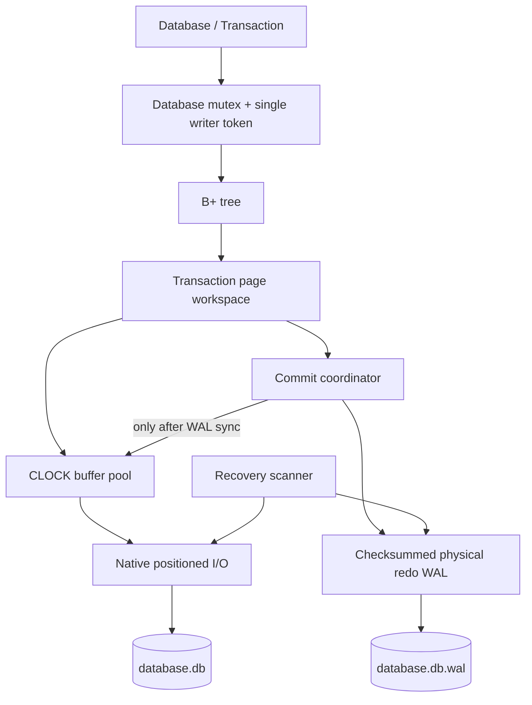

# Architecture and ownership

AtlasDB is an embedded ordered byte-string map. Its storage algorithm, log
codec, transaction staging, cache, native file I/O and recovery are implemented
in this project. It does not wrap another database.

## Responsibility boundaries

| Component | Responsibility | Deliberately does not do |
|---|---|---|
| `Page` and encoding helpers | Versioned little-endian fields; CRC-32 | Native struct serialization |
| `SlottedPage` | Stable slot indexes, variable records, compaction | Tree key ordering |
| `File` | Exclusive handle ownership, complete reads/writes, sync | Interpret pages |
| `DiskManager` | Translate page IDs to offsets, checksum validation | Decide transaction durability |
| `BufferPool` | Pin counts, latches, dirty tracking, CLOCK, WAL barrier | Cache uncommitted images |
| `PageAccess` / workspace | Read-through private page images; allocation/free list | Issue disk writes |
| `BPlusTree` | Sorted operations, structural mutation, full validation | Commit or recover a transaction |
| `Wal` | Framing, checksums, transaction grammar, page images | Expose uncommitted changes |
| Database coordinator | State machine, locking, ordered commit, recovery | SQL planning, background jobs |

The coordinator is intentionally synchronous. A successful modifying commit
returns after both the WAL and the modified data pages have been synchronized.
Full-page redo still matters: a process can die halfway through writing those
data pages. All structural modifications, including metadata and freed pages,
belong to the same transaction image set.

## Ownership and lifetime

`Database` owns a shared implementation. A `Transaction` retains that
implementation, so it can finish even if the original `Database` object is
destroyed. Transactions are move-constructible, not copyable or move-assignable.
Destroying an ACTIVE transaction discards its workspace and releases the writer
token. The last owner closes the database if no failure has poisoned it.

Call `close()` explicitly when close errors must reach the application.
Destructors cannot report failures by throwing; an optional logger receives
close errors. An explicit close releases file handles and refuses to proceed
while a transaction is active.

The buffer pool owns stable heap-allocated frames. A move-only guard pins one
frame and holds its exclusive page latch. Destruction releases the latch, then
decrements the pin count under the pool metadata mutex. Replacement never
chooses a pinned frame. The tree copies a page and immediately releases the
guard, so it does not hold a parent pin while recursively fetching a child.
Even a one-frame cache can serve tree operations.

Low-level guards must not outlive their pool. Do not acquire the same page twice
on the same thread while holding its guard: its latch is intentionally
non-recursive. These low-level types are educational building blocks; normal
applications use `Database` and `Transaction`.

## Locking

1. Public database/transaction calls acquire the database mutex.
2. Pool lookup/eviction acquires the pool metadata mutex.
3. Fetch increments pins, releases metadata, then acquires the page latch.
4. File operations serialize positioned I/O on each file handle.

Eviction and flush never wait for a pinned page's latch. They reject a flush
with outstanding pins and skip pinned eviction candidates. This prevents an
inversion against guard destruction. The pool's own metadata is protected even
when tested outside a `Database`.

Application callbacks are invoked while the database mutex is held. They must
not re-enter the engine. Logger exceptions are suppressed; test fault hooks
may throw and deliberately poison an in-progress commit.

## Resource costs

Cache frames are bounded by `Options::buffer_pages`. A transaction's changed
page images are separate, unbounded memory proportional to its write set.
Recovery retains the newest committed image of each affected page, so its peak
memory is proportional to distinct pages represented in the retained WAL.
Scans return a vector; use their `limit` argument for bounded result sizes.

There is no background checkpoint worker. `checkpoint()` synchronizes the
database, truncates the WAL to its immutable header, synchronizes that
truncation, and starts a new session. Close performs the same operation without
starting a new session. Long-lived applications should checkpoint deliberately.
