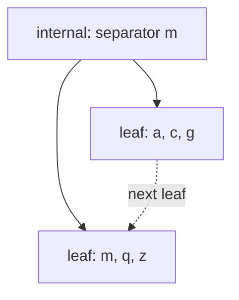

# B+ tree invariants and mutation

Leaves store key/value records. Internal nodes store separators and child page
IDs. Every node is a slotted disk page, including a one-leaf empty tree.

Search chooses `upper_bound(separators, key)`. A separator is the exact minimum
of the subtree to its right. Range scans descend once to the first relevant
leaf and follow next-leaf links; lower bounds are inclusive, upper bounds
exclusive. A result limit is applied before visiting additional leaves.

## Occupancy derived from worst-case record size

The version 1 layout reserves space using the maximum permitted record length:

* Leaf capacity: `floor((4096-64)/(4+4+128+512)) = 6` records.
* Internal capacity: `floor((4096-64)/(4+10+128)) = 28` separators, 29 children.
* Non-root minimum: 3 leaf records or 15 internal children.

The root is either one leaf (possibly empty) or an internal node with at least
two children. Count-based occupancy is conservative for small values: many
bytes remain unused. The benefit is a simple provable split/merge policy
regardless of variable key/value sizes. Byte-balanced nodes and overflow values
are substantial future format/algorithm work, not silently claimed features.

## Insert and update

An existing key replaces its value. A new key is inserted in sorted order. A
seven-record leaf splits into three and four records. The new right leaf
inherits the old successor; the left leaf points to the new right leaf. The
parent receives a child pointer and recomputes separators.

An internal node with 30 children splits into 15 and 15. Overflow propagates
recursively. Splitting the root allocates a new internal root; metadata's root
ID changes in the same transaction. Separator recomputation descends to subtree
minimums. It is straightforward to audit, but does more reads than maintaining
explicit minimum-change propagation.

## Delete

After deleting from a child, an underfull child and one adjacent sibling are
considered together. If their combined occupancy can leave both at minimum,
their sorted contents/children are redistributed roughly in half. Otherwise,
the right sibling is merged into the left and the right page enters the
transactional free list. A leaf merge also repairs the next-leaf link.

Internal merges concatenate child arrays and rebuild separators. Underflow
propagates toward the root. A root with only one remaining child is replaced by
that child and its old page is freed. File size stays at its allocation
high-water mark; later splits reuse those pages.

The arithmetic prevents overfull merges: `2+3 <= 6` for leaves and
`14+15 <= 29` for internal children. Redistribution handles the case where a
sibling has spare occupancy.

## Atomic structural changes

A split is not a sequence of individually visible disk updates. All affected
pages, leaf links, free-list changes and metadata are private transaction
images. Readers continue to use the committed tree. Commit first logs the
complete image set and a commit record, then synchronizes WAL. Only then can
the image set reach the shared buffer or disk. If the process dies after
writing only some of these pages, recovery replays the complete committed set.

## Validation

Depth-first validation checks type, slot bounds, checksum, key ordering,
occupancy, valid references and exact separators. It records every visited page
to reject cycles, shared children and duplicate references. It checks that
adjacent subtree ranges do not overlap and that all leaves have equal depth.

The independently collected in-order leaf list must match every next-leaf
pointer exactly. The free list is traversed separately, with the same ownership
set. Tree pages, metadata and free pages must account for every allocated page
exactly once. The summed leaf records must equal metadata's record count.

`Database::verify()` checks persistent page checksums and then validates using
a fresh buffer, so an already cached page cannot conceal disk corruption.
