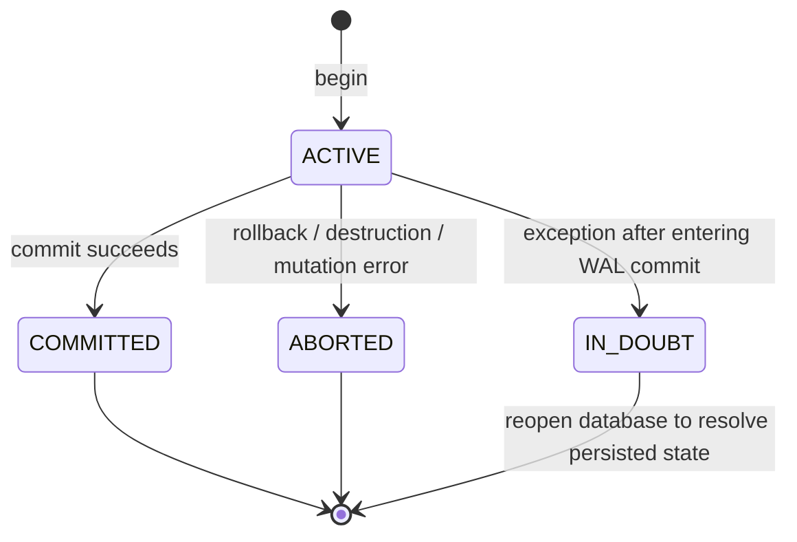

# Transaction and concurrency contract

AtlasDB implements an atomic ordered map with synchronous durability barriers.
It does not implement SQL, MVCC, general lock management or a full SQL-style
ACID contract.

## State machine

`put` is an upsert. `erase` returns whether the key existed. `get` returns
`std::optional<std::string>`. Transactions see their own changes. A mutation
exception aborts the entire transaction, preventing a partially modified
workspace from being committed. Validation/allocation failures before the WAL
commit begins have not modified persistent state. A failure after entering
the WAL commit path sets IN_DOUBT and poisons that database handle.

IN_DOUBT deliberately does not mean ABORTED. The OS may have persisted a commit
even if synchronization or later page installation reported an error. Reopen,
recover, and inspect application keys to resolve the outcome. AtlasDB does not
provide automatic transaction retry or an application-level idempotency key.

## Isolation and synchronization

Only one writer transaction may be active per database instance. `begin()`
throws `BusyError` if a writer exists, including on the same thread. Callers
may explicitly retry. Other threads may make `Database::get/scan` calls while
that transaction is ACTIVE: they see the last committed tree, never private
images. Public operations are serialized by a mutex; reads are not executed in
parallel and block while a commit is in progress.

Each `Database::get` or `scan` observes one committed state. Two separate
database reads are not a snapshot across the intervening time. A writer's
reads are stable against other commits because no other writer can commit
until it finishes. This is a coarse single-writer isolation model, not MVCC.

Methods on a live transaction serialize through the same mutex. Object moves,
destruction and lifetime management must not race with calls using that object.
No fairness or wait-free progress guarantee is made. Callbacks must not
re-enter the same database.

The file is exclusively owned across processes/instances for its open lifetime:
Windows denies handle sharing; POSIX uses nonblocking advisory `flock`.
Programs bypassing advisory locking can still damage a POSIX file.

## Commit order

1. Seal final metadata in the private image set.
2. Append BEGIN, one PAGE record for each image, then COMMIT with the image count.
3. Synchronize the WAL using the native OS durability barrier.
4. Advance the buffer pool's current durable LSN.
5. Install the committed images; cache eviction may now write them.
6. Flush remaining dirty pages and synchronize the database file.
7. Publish the committed metadata, release the writer token, return success.

An empty read-only transaction commits without a WAL group or disk sync.
Rollback discards private images without writing an ABORT record or undoing
disk pages: the no-steal policy guarantees there are no uncommitted disk
changes to undo. This is actual atomicity by withholding changes, not a
simulated transaction API around immediate writes.

## Operational use

Use batches to amortize sync and page-image costs. Bound transaction write sets
at the application level. Call `checkpoint()` during long sessions to bound
retained WAL size; it requires no active transaction. Use explicit `close()`
when shutdown I/O failures must be surfaced. A poisoned handle must be
destroyed before reopening, because it continues to own the exclusive file lock.
