# WAL, partial failure and recovery

Updating a split leaf, its parent, its successor link and database metadata
requires multiple writes. Those writes are not atomic as a group. Writing data
first could leave a tree whose root references a page that never reached disk.
The WAL provides a durable complete description before that can happen.

AtlasDB uses physical redo with **no steal** (private changes never enter the
shared buffer) and **force at successful commit** (all committed dirty pages
are synchronized before returning). Complete page images repair torn writes
to pages covered by the retained WAL. This avoids physiological redo, undo
chains and compensation records, at the cost of memory and write amplification.

## Enforcing write-ahead order

The coordinator never installs transaction images before WAL sync returns.
The buffer pool independently rejects flushing a dirty page whose LSN exceeds
its durable WAL boundary. Both explicit flush and eviction use that check.
The unit suite dirties a pinned page with a future LSN and proves that neither
flush nor eviction can bypass the boundary.

## Startup protocol

A cleanly closed/checkpointed WAL contains its 64-byte immutable header only.
A running database has a synchronized SESSION record. Any records or partial
record bytes beyond the header indicate a dirty session.

1. Acquire exclusive database ownership and read immutable identity bytes.
2. Open its matching WAL and validate the WAL header identity/checksum.
3. Scan the complete stream. Validate framing, CRC, contiguous LSNs, transaction
   IDs, legal record order, image identities and commit image counts.
4. Accumulate only committed groups. Retain the latest committed image per page.
   Incomplete groups are discarded; no undo is needed under no-steal.
5. On a dirty session, redo these images and synchronize the database.
6. Validate metadata, exact file length, checksums, tree, leaf chain and free list.
7. Only after success, reset/synchronize WAL and start a new durable SESSION.

No database page is overwritten until the entire WAL scan succeeds. A complete
record with a bad checksum fails closed. Recovery does not silently truncate
at that record and discard potentially committed work beyond it.

## Failure matrix

| Failure boundary | Allowed recovered state |
|---|---|
| Private mutation, before BEGIN | Previous committed state |
| BEGIN / incomplete PAGE records, no complete COMMIT | Previous committed state |
| Complete COMMIT written but not synchronized | Previous or entire new state; never partial |
| WAL sync succeeded, before data writes | Entire new state via redo |
| Some committed pages written | Entire new state via full-page redo |
| Database sync succeeded, before return | Entire new state, even without acknowledgment |
| Recovery interrupted while replaying pages | Retry redo from retained WAL |
| Recovery interrupted after data sync, before log reset | Repeat same images safely |
| WAL reset completed | Synchronized, validated database already contains those commits |

Recovery is idempotent because replay overwrites pages with the same complete
committed bytes and keeps its source until data sync and validation succeed.
Page LSN comparison is intentionally unnecessary for this protocol.

## Truncation versus corruption

An EOF inside a trailing record header or its correctly framed payload is an
incomplete suffix. The scanner reports the discarded byte count and ignores
that uncommitted suffix. A complete record with a bad CRC, impossible length,
unknown type, invalid transaction order or wrong LSN is corruption and rejects
open. A malformed full header is not presumed to be a harmless torn tail.

Artificially truncating a previously acknowledged commit from a WAL whose data
was also lost violates the durability assumptions. No parser can infer the
missing bytes. The prefix tests create crashes before data installation and
test the protocol's legal prefixes, not a claim of recovering arbitrary loss.

## What can and cannot be repaired

Retained committed images can repair torn/checksum-failing data and mutable
metadata pages. Unlogged damage after a checkpoint cannot be reconstructed.
The database identity bytes are needed before recovery; corruption of those
bytes fails closed even if other metadata bytes could have been repaired.
Truncated/corrupt WAL headers and wrong-database WAL files also fail closed.
Checksums do not provide cryptographic protection or a substitute for backups.

Both `.db` and `.db.wal` must stay together. Do not delete a WAL to make a failed
open succeed. Back up after a successful `close()`, while no other process can
open/mutate the pair. Live file-copy backup and online repair are not supported.

## OS and hardware assumptions

Windows uses complete `ReadFile`/`WriteFile` loops and `FlushFileBuffers`.
POSIX uses `pread`/`pwrite`, `fsync`, and a parent-directory sync when opening a
create-capable file. Native calls and short I/O errors are reported explicitly.

The contract assumes a local filesystem and device honoring sync barriers and
file-length updates. Process termination tests do not simulate a controller
lying about durable writes, lost directory entries, arbitrary filesystem
reordering or physical power removal. Initial creation of the two-file pair is
not an atomic filesystem operation: an interrupted initial creation can leave
an unusable empty/partial pair, before any commit was acknowledged. Files are
never automatically deleted to hide that failure. Network filesystems and
arbitrary hardware power-loss safety are outside the tested contract.
